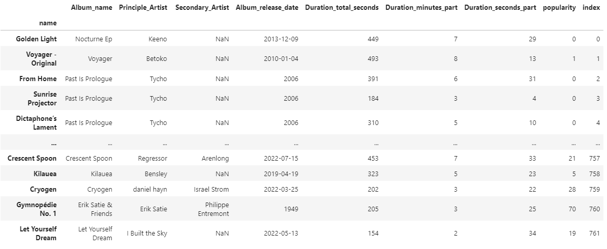

## Introduction
I love music. I grew up listening to classic and progressive rock with my dad, and singing with my family in a church choir. My grandma taught me piano and I started with the trumpet in grade school.
Music continues to be a part of my life, if right now only passively. I have a Spotify premium account, and have paid for an app that keeps track of and displays my Spotify data in a very comprehensive way.
Some people enjoy seeing their Spotify Wrapped once a year; I need 10 times that much data every day. With the help of the _Spotipy_ Python module and Spotify's API, I can now make that happen for myself, 
and I'll teach you how.

## APIs and _Spotipy_
Getting data from the internet has endless possibilities. Web scraping makes it possible to most medium-scale data retrievals for your projects.
Possible doesn't always mean easy, and since Spotify is a paid service, restrictions exist to make it difficult to scrape data from your own Spotify account.
Thankfully Spotify has a [proprietary API](https://developer.spotify.com/documentation/web-api/) providing dozens of commands to get different data on all things Spotify.
With this API you can formulate GET requests to retrieve data about playlists, artists, songs, etc. How convenient!

That's not even the best part. Sometimes those GET requests can get tricky to formulate exactly, and authentication can be a complicated mess. 
With the [_Spotipy_](https://spotipy.readthedocs.io/en/master/) Python library, you can query Spotify's API with Python functions and get data in dictionary type. 
This is how I set it up: 

```
import spotipy

from spotipy.oauth2 import SpotifyClientCredentials

spotify = spotipy.Spotify(auth_manager=SpotifyClientCredentials(client_id, client_secret))
```
I obtained my `client_id` and `client_secret` codes/keys by logging into [Spotify for Developers](https://developer.spotify.com/dashboard/applications) (at least available to all who have Spotify premium accounts), creating an application, and grabbing the two keys shown in the image below, which you can see after clicking "SHOW CLIENT SECRET".


## My focus playlist

After exploring many of _Spotipy_'s methods and Spotify's [possible endpoints](https://developer.spotify.com/documentation/web-api/reference/#/), I was excited to make a dataset containing songs as rows. I picked one of my biggest playlist, the one I often listen to while doing homework or work. It is called Focus. There are 762 songs, enough to do good analysis. I kept a couple of the columns but made a few more, since for some columns the value was not a number or even a categorical variable but a whole json object (in Python's case a dictionary). I ended up with this dataframe:



My steps were (very quickly):
- Getting all my playlists with `spotify.user_playlists(my_username)['items']`
- Getting the URI associated with my focus playlist
- Getting all the songs from that playlist with `spotify.playlist_items(focus_playlist_uri)['items']`
- Putting all those songs into a pandas DataFrame with `pd.DataFrame.from_dict()`
- Building new columns with `pd.Series.apply`

See the full code in [**this repository**](https://github.com/neil826t/Spotify_API_stats386)

## Ethics and Legality

I read Spotify's [Developer Policy](https://developer.spotify.com/policy/). Since I was just working with my own data, there are no issues with visualizing and posting my own data publicly. In fact, you can go look at the playlist yourself on Spotify's website [here](https://open.spotify.com/playlist/45JTnzWMn7TW1VJW69Wl6T).

## Conclusion

In summary, I'm pretty happy that Spotify and _Spotipy_ have provided these resources for us to use for free. Using an API can be as simple as a quick `pip install` and then `import`, with a good look at documentation. Here I made a dataframe out of one of my Spotify playlists, and I encourage you to do something different when you use the API. Next time I will be analyzing this dataframe, to see if popularity is correlated with any of the other features!
